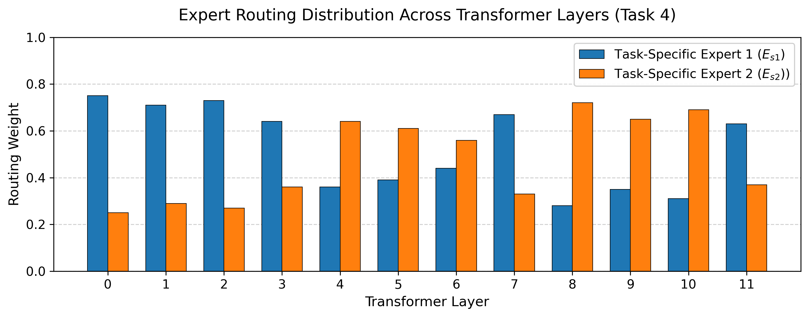

# Rebuttal Repository Overview

 This repository is prepared for rebuttal and serves two purposes:

 - **`## SCR Code Reference`**
   - This section addresses the reviewer's **Q2/Q3 codebase questions**.

 - **`## Analysis of Routing Distribution`**
   - This section addresses the **limitation discussion on** **Routing Collapse**.

 ## **Answer to “Q2/Q3”**

 For ease of inspection, the `SCR_calculate/` folder only contains the minimum files required to compute **SCR**.

 **Which file contains SCR in the code files?**

 The SCR computation is implemented in **`SCR_calculate/calculate_SCR.py`**.

 **Relevant line numbers:**

 - **`SCR_calculate/calculate_SCR.py:72-112`**
   - Function `compute_scores_with_matrix(...)`
   - This is the core implementation that computes the task-wise SCR score from:
     - the zero-shot performance matrix, and
     - the task-to-upstream similarity matrix.
     - The task-to-upstream similarity matrix is computed by **`SCR_calculate/calculate_sim.py`**.

 - **`SCR_calculate/calculate_SCR.py:220-223`**
   - This part aggregates the task-wise scores and prints the final overall **SCR** value.

 - **`SCR_calculate/calculate_SCR.py:225-237`**
   - This part additionally computes and prints the low-, mid-, and high-similarity grouped SCR values.

 ## **Answer to “Limitation: Routing Collapse”**

 ### Figure: Expert Selection Weights across Blocks (Final Task)

 

 ### Analysis & Key Findings

 We appreciate the reviewer's keen observation regarding the potential for "routing collapse" in MoE architectures. This repository provides empirical evidence demonstrating that our Plasticity Pathway effectively maintains balanced expert utilization without requiring an explicit auxiliary load-balancing loss.

 As stated in our manuscript's Appendix B (Experimental Details), the gating mechanism for the two task-specific experts utilizes Noisy Top-k gating. By injecting tunable Gaussian noise into the router logits prior to the Softmax activation, we ensure adequate expert exploration during training. This inherent design effectively prevents the network from lazily converging on a single expert.

 To validate this, the visualization above illustrates the routing distribution between Task-Specific Expert 1 ($E_{s1}$) and Task-Specific Expert 2 ($E_{s2}$) across all Transformer layers during Task 4 (the final task) of the EuroSAT dataset.

 As shown in the figure, both task-specific experts are actively utilized across all Transformer layers. There is no instance of a single expert being entirely starved, nor is there a global collapse where the network exclusively relies on one expert. This distribution confirms that both experts actively collaborate to process the data, demonstrating that the Noisy Top-k gating successfully maintains a healthy routing balance and empirically ruling out the occurrence of "routing collapse."
